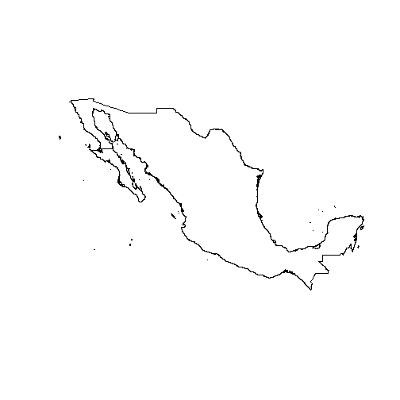
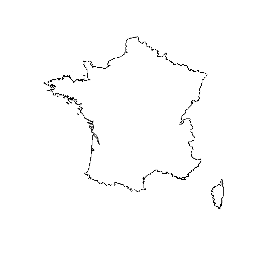
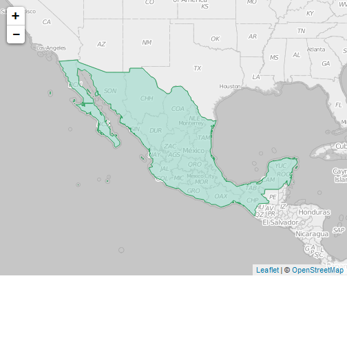
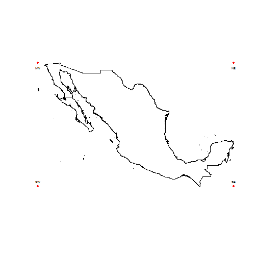
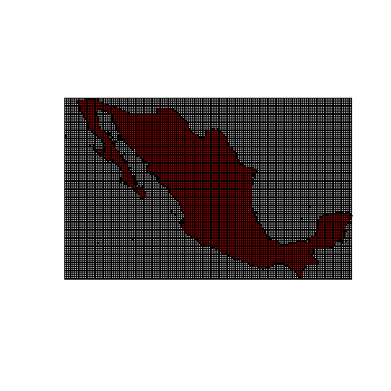
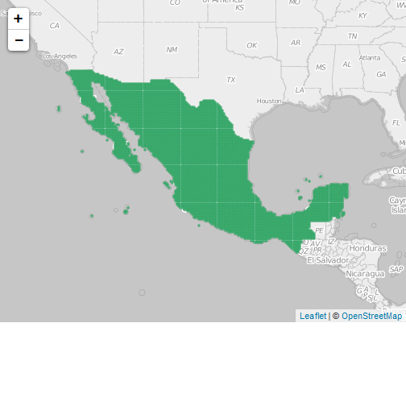

Shape files (*.shp*) are commonly imported into *R* as a *SpatialPolygonsDataFrame* or *SpatialPointsDataFrame* class object. This kind of data may require a great deal of memory. However, it offers many useful functions for processing. Therefore, creating grids defined as a *SpatialPolygonsDataFrame* class object can be very useful for data processing. In addition, it allows a simple interaction with data visualization methods focusing on the interactivity of web platforms.

## Vignette Info

The information contained in this vignette corresponds to the structure of the *grd_build()* function of the rspecies package. The description of the function is established in several steps in order to illustrate how the function is constructed. For more information on this function you can consult the *help(grd_build)* or *?grd_build*.

## Step 1

As a first step it is necessary to load the rspecies package. As a second step is to obtain a polygon of some geographical area. You can use the integrated *Mex0* data in the rspecies package or you can use the *getData()* function of the raster package to download ([GADM](http://www.gadm.org/)) shapefiles.


```r
# loading libaries ------------------------------------------

library(rspecies)
library(sp)
library(rgdal)
library(raster)
```


```r
# loading data from rspecies package ------------------------
data(Mex0)
class(Mex0)
```

[1] "SpatialPolygonsDataFrame"
attr(,"package")
[1] "sp"

```r
slotNames(Mex0)
```

[1] "data"        "polygons"    "plotOrder"   "bbox"        "proj4string"

```r
# Obtaining data from GADM using getData() from raster package

Fra0<-raster::getData('GADM', country='FRA', level=0)
class(Fra0)
```

[1] "SpatialPolygonsDataFrame"
attr(,"package")
[1] "sp"

```r
slotNames(Fra0)
```

[1] "data"        "polygons"    "plotOrder"   "bbox"        "proj4string"


```r
# ploting both polygons -------------------------------------
plot(Mex0)
plot(Fra0)
```



You can add some dynamic interaction using the [leaflet](https://rstudio.github.io/leaflet/) package.


```r
library(leaflet)

# Making the map --------------------------------------------

leaflet(width = "100%") %>%
addProviderTiles('OpenStreetMap.BlackAndWhite',
 options = providerTileOptions(noWrap = TRUE))%>%
addPolygons(data=Mex0, stroke=TRUE, color = '#2ca25f',
layerId = Mex0, weight = 1, opacity = 1,
fillColor = '#99d8c9', fillOpacity = 0.6)
```



## Step 2

The next step is to know the geographical projection system (GPS) and the bounding box of the polygon.  GPS is important for calculating the number of cells that will form the GRID. In this sense, we suggest using a geographic projection system whose unit of measurement is given in meters. Metric systems, such as UTM or WEB UTM, have the ability to preserve areas. In addition, the calculation of the distance between two points can be made through a Euclidean distance.


```r
# Obtaining geographical projection system -----------------------

proj<-sp::proj4string(Mex0)
proj

# Obtainin EPSG code ---------------------------------------------

rgdal::showEPSG(proj)
```

```
## [1] "+proj=longlat +datum=WGS84 +no_defs +ellps=WGS84 +towgs84=0,0,0"
## [1] "4326"
```

The EPSG code shown above corresponds to the WGS84 system commonly used in systems such as: the GPS satellite navigation system and NATO military geodetic surveying. Further details of the gepographic projection systems and their corresponding EPSG coding can be found in this [link](http://spatialreference.org/ref/).

The next step is to transform the geographic projection system of the polygon into some geographical projection system whose unit of measurement is given in meters. Geographic poject systems with metric systems have the ability to preserve areas. Therefore, in this case the WEB Mercator system is used, whose EPSG coding is [EPSG: 3857](http://spatialreference.org/ref/sr-org/6864/).


```r
# Obtaining EPSG:3857 definition -----------------------

proj4trans <- sp::CRS("+init=epsg:3857")

# Transforming the polygon -----------------------------

Mex0_trans <- sp::spTransform(Mex0, proj4trans)
sp::proj4string(Mex0_trans)
```

```
## [1] "+init=epsg:3857 +proj=merc +a=6378137 +b=6378137 +lat_ts=0.0 +lon_0=0.0 +x_0=0.0 +y_0=0 +k=1.0 +units=m +nadgrids=@null +no_defs"
```

Once the projection system is established, obtaining the bounding box of the polygon is performed through the *bbox()* function of the sp package.


```r
# Obtaining the bounding box -----------------------

bb <- bbox(Mex0_trans)

# Transforming bb into a expand matrix -------------

bb_points <- matrix(c(bb["x", "min"], bb["y", "max"], bb["x", "min"], bb["y", "min"], bb["x","max"], bb["y", "max"], bb["x", "max"], bb["y", "min"]), 4, 2, byrow = T, dimnames = list(c("NW","SW", "NE", "SE"), c("X", "Y")))
```


|   |         X|       Y|
|:--|---------:|-------:|
|NW | -13176764| 3857938|
|SW | -13176764| 1635429|
|NE |  -9652528| 3857938|
|SE |  -9652528| 1635429|


```r
# Transforming bb_points into a SpatialPoints object
# with the same projection system as Mex0_trans. ---

bb_sp <- sp::SpatialPoints(bb_points, proj4string = sp::CRS(sp::proj4string(Mex0_trans)))

plot(Mex0_trans)
plot(bb_sp, pch = 20, col ="red", add = T)
text(bb_points, labels = rownames(bb_points), pos = c(1,3,1,3), cex = 0.5)
```




## Step 3

The third step is to know the distance between the extreme points of the bounding box and the number of cells per direction. If the resolution of the cell is given in kilometers, it is necessary to re-scale the distances obtained from the polygon whose projection system is given in meters. To do this it is enough to divide the distance between a thousand and thus obtain a resolution measured in kilometers.


```r
# Claculating distance between points --------------

bb_dist <- (sp::spDists(bb_sp, longlat = F)/1000) # Divided by a thousand to get 
                                                  # the unit in kilometers
dimnames(bb_dist) <- list(rownames(bb_points), rownames(bb_points))
```


|   |       NW|       SW|       NE|       SE|
|:--|--------:|--------:|--------:|--------:|
|NW |    0.000| 2222.509| 3524.236| 4166.508|
|SW | 2222.509|    0.000| 4166.508| 3524.236|
|NE | 3524.236| 4166.508|    0.000| 2222.509|
|SE | 4166.508| 3524.236| 2222.509|    0.000|

Note that the diagonal of the previous matrix contains only zeros. This is because the distance of a point with itself is zero. Also, note that the above matrix is a symmetric matrix, ie the distance between NW and NE is the same as SW and SE. The same happens with the distances NW-SW and NE-SE. Consequently, to obtain the number of cells per direction can be done by dividing the distance $(NW-NE)/resolution$ and $(NW-SW)/resolution$. If we fix a resolution of 20 km per side, the grid associated with this bounding box can be calculated as follows.


```r
resolution <- 20 # fix the resolution to 20

dist_longlat <- (bb_dist/resolution)[1, c(3, 2)] # calculation number of cel per
                                                 # dirección.
dist_longlat
```

```
##       NE       SW 
## 176.2118 111.1255
```

Notice that the number of cell per direction is not an integer, so we can round this number to create an integer number. Using the *floor* function we can obtain 176, 111.


```r
cs0 <- diff(t(bb))/dist_longlat  # cell size. without rounding
cs1 <- diff(t(bb))/floor(dist_longlat)  # cell size. with floor function

cs0
cs1
```

```
##         x     y
## max 20000 20000
##            x        y
## max 20024.07 20022.61
```

The effect associated with the rounding applied in this case is approximately 25 meters in the direction of the longitude and 23 meters in the direction of the latitude. However, this effect can be reduced by calculating the offset associated with each cell. The offset is the noise due to rounding applied to the number of cells.


```r
cc0 <- bb[, 1] + (cs0/2)  # cell offset.
cc0

cc1 <- bb[, 1] + (cs1/2)  # cell offset.
cc1
```

```
##             x       y
## max -13166764 1645429
##             x       y
## max -13166752 1645440
```

The offset is expressed as a coordinate where the centroid of the first cell will be positioned to adjust the number of cells per direction, which in the case of an exact resolution the centroid of the first cell will be positioned in the coordinate -1.3166764 &times; 10<sup>7</sup>, 1.6454286 &times; 10<sup>6</sup>. Note that the coordinate has an EPSG projection system, [EPSG: 3857](http://spatialreference.org/ref/sr-org/6864/).

## Step 4

The next step is to generate the grid with the characteristics described in the previous step and trim the grid to the shape of the polygon. In this sense, the realization of this stage is done using the sp package's functions *GridTopology* for the construction of the topology of the grid and *as.SpatialPolygons.GridTopology* to transform the topology into an object class with the same properties of the polygon.


```r
# Creating the GRID Topology ------------------------
pol_grd <- sp::GridTopology(cellcentre.offset = as.vector(cc0), cellsize = as.vector(cs0), cells.dim = floor(dist_longlat)) # for exact resolution construction

# Transforming into SpatialPolygons -----------------
sp_pol <- sp::as.SpatialPolygons.GridTopology(pol_grd, proj4string = CRS(proj4string(Mex0_trans)))

# View grid with plot ----------------------------------------

plot(Mex0_trans, col = "red")
plot(sp_pol, add = TRUE)
```



The cropping can be done using with the function *gIntersects()* of the package rgeos.


```r
# Cropping the GRID -------------------------------------
intg <- rgeos::gIntersects(Mex0_trans, sp_pol, byid = T)
sp_pol_int <- sp_pol[intg]


# Transforming to the original projection system --------

Mex0_grd <- sp::spTransform(sp_pol_int, proj4string(Mex0))

Mex0_df <- data.frame(ID = 1:length(Mex0_grd), row.names = sapply(Mex0_grd@polygons,
        methods::slot, name = "ID"))

Mex0_grd <- sp::SpatialPolygonsDataFrame(Mex0_grd, Mex0_df, match.ID = TRUE)

# Leaflet -----------------------------------------------
leaflet(width = "100%") %>%
addProviderTiles('OpenStreetMap.BlackAndWhite',
 options = providerTileOptions(noWrap = TRUE))%>%
addPolygons(data=Mex0_grd, stroke=TRUE, color = '#2ca25f',
layerId = Mex0_grd, weight = 1, opacity = 1,
fillColor = '#99d8c9', fillOpacity = 0.6)
```



## *grd_build* function

In order to avoid the step below, we defined a function that allow us to reproduced this step in one simple way. Further deteails about this function can be consulted in (https://github.com/edelcallejoc/rspecies)


```r
# without pretty options --------------------------------------------
system.time(Mex0_grd1<-grd_build(Mex0)) # creating the GRID with 20Km resolution
```

   user  system elapsed 
  11.27    0.19   12.55 

```r
# with pretty options -----------------------------------------------
system.time(Mex0_grd2<-grd_build(Mex0, pretty.int=T))
```

   user  system elapsed 
 105.33    0.62  113.83 

```r
# leaflet interaction -----------------------------------------------

m1 <- leaflet(width = "100%") %>%
addProviderTiles('OpenStreetMap.BlackAndWhite',
 options = providerTileOptions(noWrap = TRUE))%>%
addPolygons(data=Mex0_grd1, stroke=TRUE, color = '#2ca25f',
layerId = Mex0_grd1, weight = 1, opacity = 1,
fillColor = '#99d8c9', fillOpacity = 0.6)
m1
```


```r
m2 <- leaflet(width = "100%") %>%
addProviderTiles('OpenStreetMap.BlackAndWhite',
 options = providerTileOptions(noWrap = TRUE))%>%
addPolygons(data=Mex0_grd2, stroke=TRUE, color = '#2ca25f',
layerId = Mex0_grd2, weight = 1, opacity = 1,
fillColor = '#99d8c9', fillOpacity = 0.6)
m2
```


